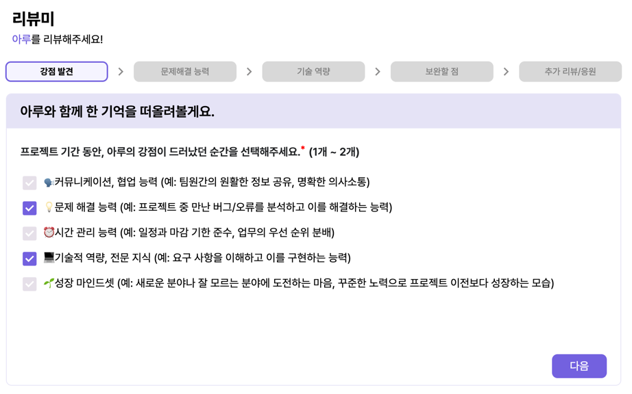
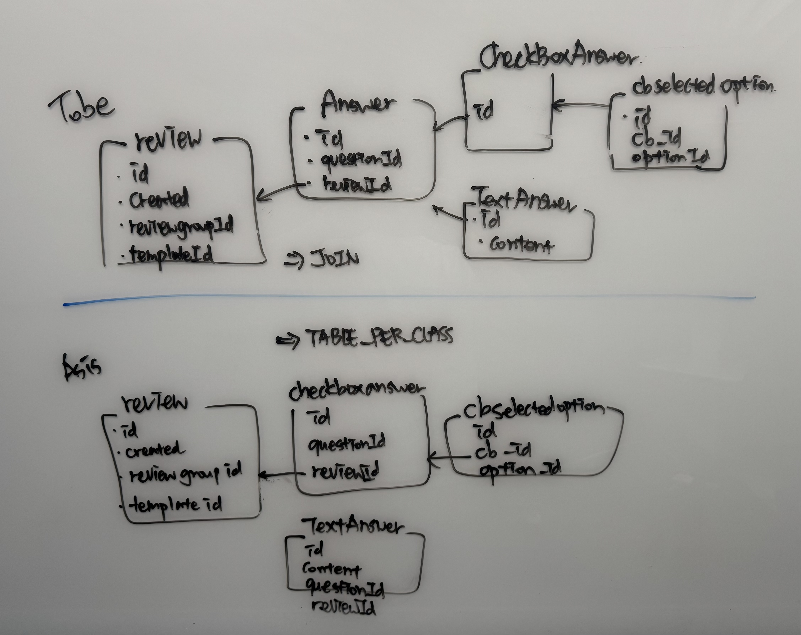

# 추상화를 사용해 유연한 코드로 탈바꿈하기

안녕하세요, 우아한테크코스에서 <strong>리뷰미</strong>라는 팀에서 열심히 일하는 아루입니다. 오늘 이 글에서는 추상화에 대해서 다루어보려고 해요. 나아가 팀 프로젝트의 확장 가능성을 염두에 두면서 추상화하는 방법에 대해서 소개합니다.

프로젝트 내부 구조를 개선하고자 했기 때문에 간단하게 프로젝트를 소개해 보겠습니다. <strong>리뷰미</strong>는 함께 프로젝트를 진행한 팀원들끼리 상호 리뷰를 통해 나를 더 알아가기 위해 만들어졌어요. 다른 사람이 바라보는 시각을 통해 나를 더 잘 파악하도록 하는 서비스입니다. 리뷰를 받고 싶다면 리뷰 그룹을 생성해 다른 팀원들에게 링크를 공유하고, 링크를 받은 팀원은 리뷰를 작성할 수 있는 형식이예요. 리뷰의 형식은 주관식/객관식이 존재한답니다.

<p align="center"></img></p>

현재 저희 질문-답변 구조는 꽤나 복잡하게 설계되었어요. 객관식/주관식만의 타입이 있을 줄 알았죠. 추가적인 질문 형식을 고려하지 않아 아래와 같은 객체 구조를 가지고 있습니다. 팀원이 리뷰를 작성할 때 저장되는 형식은 아래와 비슷합니다. 확장에 너그러운 형식일 지 고민해봅시다.
```java
public class Review {
    // ..
    @OneToMany(fetch = FetchType.EAGER, cascade = CascadeType.PERSIST)
    @JoinColumn(name = "review_id", nullable = false, updatable = false)
    private List<TextAnswer> textAnswers;

    @OneToMany(fetch = FetchType.EAGER, cascade = CascadeType.PERSIST)
    @JoinColumn(name = "review_id", nullable = false, updatable = false)
    private List<CheckboxAnswer> checkboxAnswers;
    // ...
}
```
딱 보아도 확장에 불리한 설계입니다. 만약 `1 ~ 100` 사이의 값을 고르도록 하는 스케일 형식이 새로운 답변 형식으로 등장한다면 어떨까요? 질문의 타입 중에는 체크박스 외에도 여러 방식으로 설계될 수 있어요. 프로젝트 초기에는 객관식/주관식만을 생각했기 때문에 리뷰라는 테이블에 모든 것을 담아두었지만, 이제는 다른 형식의 답변을 받지 못하는 도메인이 되었습니다. 이 부작용은 주관식/객관식 답변을 사용할 때마다 나타났어요. 예를 들면, 사용자가 리뷰를 제출할 때 아래와 같은 로직을 수행하게 됩니다.
```java
public void validate(Review review) {
    validateAnswer(review.getTextAnswers(), review.getCheckboxAnswers());
    validateAllAnswersContainedInTemplate(review);
    validateAllRequiredQuestionsAnswered(review);
}

private void validateAnswer(List<TextAnswer> textAnswers, List<CheckboxAnswer> checkboxAnswers) {
    textAnswers.forEach(textAnswerValidator::validate);
    checkboxAnswers.forEach(checkBoxAnswerValidator::validate);
}
```
이와 같은 사항은 리뷰 도메인에서의 변경이 `Validator`와 같은 다른 객체에도 영향을 미친다는 것이예요. 변경이 전파될수록 유지보수에는 어려워집니다. `Review`라는 것만을 따로 관리할 수 없게 되고, 커다란 하나의 객체를 어색하게 떨어뜨려 둔 모습이네요. 새로운 답변 형식이 추가된다면 이를 검증하는 `ReviewValidator`의 인자 또한 변화를 겪겠네요. 모든 리뷰의 검증을 담당하는 책임이 너무 부담스러워 보이기도 하고요.

이제부터는 큼직한 하나의 리뷰(답변)를 잘게 쪼개어 보겠습니다. 추상화를 통해 구체적인 것에 의존하지 않도록 하고, 의존 방향을 역전함으로써 변경의 전파를 제한하려고 해요.

## 도메인 추상화
우선 도메인에 엮여있는 `TextAnswer`와 `CheckboxAnswer`를 풀어낼 필요가 있습니다. 둘 다 답변 형식 중 하나고, `Review`에 직접 묶여있어 변경에는 취약한 형태예요. 아래와 같은 형식이면 얼마나 좋을까요?
```java
public class Review {
    // ..
    @OneToMany(fetch = FetchType.EAGER, cascade = CascadeType.PERSIST)
    @JoinColumn(name = "review_id", nullable = false, updatable = false)
    private List<Answer> answers;
    // ...
}
```
만약 위와 같은 형태로 설계된다면, 답변 형식에 변경이 발생하더라도 `Review` 도메인에서 변경할 점이 없어요. 확장에는 열려 있고, 기존 코드의 변경에는 닫혀 있는 형태가 되겠네요! 하지만 JPA 엔티티의 필드를 추상화할 수 있을까요?

### `@Inheritance` 사용하기

몇 가지 트릭을 사용하면 JPA 엔티티의 필드를 추상화할 수 있습니다. 그 중 하나가 `@Inheritance` 어노테이션을 사용하는 거예요. 상속을 명시적으로 어노테이션에 표현함으로써 JPA의 매핑 전략을 설정할 수 있습니다. `@Inheritance`에는 `strategy`라는 필드가 존재하는데요, 자식 클래스를 어떤 방식으로 테이블 매핑할지에 대한 전략을 설정해야 해요. 아래와 같은 세 가지 전략이 존재합니다.
 - `SINGLE_TABLE`: 하나의 테이블에 자식 클래스의 필드들을 `nullable`하게 둡니다. 자식끼리 서로 다른 필드가 존재할 때마다 공간 낭비가 발생하겠네요!
 - `TABLE_PER_CLASS`: 자식 클래스 하나에 테이블 하나를 매핑합니다. 좋아 보이지만, 조회할 때 모든 자식 테이블을 UNION해야 합니다.
 - `JOINED`: 공통의 클래스에 해당하는 테이블을 생성하고, 자식끼리 서로 다른 테이블이 추가됩니다. FK를 자동 설정하고, 값을 가져올 때 해당 테이블과 JOIN 연산이 일어납니다.

`Java`의 객체지향 패러다임과 가장 일치하면서, 그나마 적은 공간 낭비와 시간 효율성을 고려해 `JOINED` 전략을 사용해 보았습니다. `Review` 클래스는 위에 적어둔 대로 준비하고, 각각의 질문 타입에 대한 답변 형식을 정의해주면 되겠네요!
```java
@Entity
@Table(name = "answer")
@Inheritance(strategy = InheritanceType.JOINED)
public abstract class Answer {

    @Id
    @GeneratedValue(strategy = GenerationType.TABLE)
    protected Long id;

    @Column(name = "question_id", nullable = false)
    protected long questionId;

    @Column(name = "review_id", nullable = false, insertable = false, updatable = false)
    protected long reviewId;
    // ...
}

```
```java
@Entity
@Table(name = "text_answer")
public class TextAnswer extends Answer {

    @Column(name = "content", nullable = false, length = 5000)
    private String content;
    // ...
}

@Entity
@Table(name = "checkbox_answer")
public class CheckboxAnswer extends Answer {

    @OneToMany(fetch = FetchType.EAGER, cascade = CascadeType.ALL, orphanRemoval = true)
    @JoinColumn(name = "checkbox_answer_id", nullable = false, updatable = false)
    private List<CheckBoxAnswerSelectedOption> selectedOptionIds;
    // ...
}
```
이와 같이 설계한다면, 답변 타입이 추가되더라도 해당 클래스에만 변화가 일어납니다. 도메인 구조에 대한 변화는 잘 이루어졌으니, 이번에는 이를 검증하는 부분을 살펴볼까요?

## 검증 추상화
도메인 설계 또한 복잡하게 얽혀 있었지만, 사용자가 입력한 답변을 검증하는 부분도 만만치 않게 쓰여 있습니다. 위에서 보여드렸듯 검증을 위해 각각의 파라미터가 타입별로 설정돼야 합니다. 각각의 타입에 따라 검증 방식이 서로 다른데, 이를 어떻게 추상화할 수 있을까요?

### 전략 패턴
전략 패턴은 의존성을 떼어내기 위한 탁월한 선택지 중 하나입니다. 특정 행사에 따라 할인율을 서로 다르게 적용할 수 있는 키오스크 `Kiosk`가 있다고 합시다. 아래와 같이 표현할 수 있겠네요!
```java
public class Kiosk {
    
    private final double discountRatio = 0.3;
    
    public double calculateCost(Cart cart) {
        double totalCost = cart.getTotalCost();
        return totalCost * discountRatio; 
    }
}
```
사장은 가게 형편에 따라 할인율을 조정할 수도 있습니다. 혹은 제품의 카테고리별로 서로 다른 할인율을 적용하고 싶을 수도 있어요. 하지만 그런 상황이 발생했을 때, 주어진 코드를 활용해서 키오스크가 잘 작동하도록 할 수 있을까요? 현재로서는 키오스크를 뜯어고치는 수밖에 없겠습니다. 할인율을 변경할 때마다 기사님을 불러야 한다니, 이래서야 합리적인 가격으로 고객에게 팔아줄 수는 없겠네요.

위와 같은 코드는 정책과 강결합돼 있습니다. 가격을 계산하는 과정에서 할인율이라는 정책이 심하게 간섭하고 있는 상황이예요. 키오스크 객체가 할인율을 신경쓰지 않고, 외부에서 할인율을 받아오도록 한다면 의존성을 느슨하게 가져갈 수 있습니다.
```java
public interface DiscountStrategy {
    double applyDiscount(double cost);
}

public class Kiosk {
    
    private final DiscountStrategy discountStrategy;
    
    public Kiosk(DiscountStrategy discountStrategy) {
        this.discountStrategy = discountStrategy;
    }
    
    public double calculateCost(Cart cart) {
        double totalCost = cart.getTotalCost();
        return discountStrategy.applyDiscount(totalCost);
    }
}
```
우선 할인율 자체를 정책으로 빼내어 새로운 객체로 만들어보았어요. 키오스크가 작동될 때 할인율을 적용할 수 있으니, 사장님은 키오스크 전원을 껐다 켜는 것만으로 새로운 할인율을 적용할 수 있겠네요. 비슷한 방식으로 상품의 카테고리별 할인율도 적용할 수 있겠습니다.

### 타입에 따른 검증

리뷰미에서 리뷰를 작성하면 해당 내용이 한 번 검증됩니다. 정말 해당 질문에 추가할 수 있는 답변인지, 글자 수 제한을 넘지는 않는지, 객관식과 주관식 답변이 모두 작성되었는지 등을 확인해요. `Mapper`를 통해 객체 형식으로 만들어 둔 뒤, 이를 `Validator`에서 검증하는 형식입니다. 리뷰미 팀에서는 정책과 관련된 사항은 도메인에 적어두지 않았기에, `Mapper`에서는 정말 객체 바인딩만을 수행하고 이를 `Validator`에서 검증하게 되었어요.

`Mapper`와 `Validator` 모두 대대적인 변경이 필요하지만, 이 중 검증을 담당하는 `Validator`에 집중해 보겠습니다. `Mapper` 또한 같은 방식으로 리팩터링할 수 있음에 참고하세요!

```java
@Component
@RequiredArgsConstructor
public class ReviewValidator {
    // ...
    public void validate(Review review) {
        validateAnswer(review.getTextAnswers(), review.getCheckboxAnswers());
        // ...
    }
    // ...
}
```
앞서 전략 패턴에 대해 알아보았어요. 내부에 전략을 포함하는 것이 아니라 외부에서 이를 주입하도록 하는 것이 그 목표였습니다. 이를 통해 의존성을 느슨하게 가져가거나, 온전히 끊어낼 수도 있어요. 스프링 프레임워크에서는 빈 컨테이너를 관리하며 의존성 제어를 진행합니다. 실제로 `@Autowired`를 통해 외부에서 객체를 주입받죠. 이를 통해 어플리케이션 개발자는 클래스 그 자체의 관심사에만 집중할 수 있습니다. 

리뷰를 검증하는 과정을 스프링의 도움을 받아 추상화할 수 있을까요? 리뷰를 검증하는 것 또한 하나의 **전략**입니다. 이 전략을 외부로 빼낸다면 의존성을 뒤집을 수 있겠네요. 리뷰미에는 현재 아래와 같은 검증 로직이 존재해요.
- 객관식 답변인 경우
  - 선택한 개수가 올바른지
  - 선택한 답안이 주어진 질문에 속하는지
- 주관식 답변인 경우
  - 답변의 길이가 제한을 넘어가지는 않는지

검증할 게 많지 않았지만 로직을 작성하는 데에 어려움을 겪었습니다. 초기에는 `Review` 안에 `TextAnswer`와 `CheckboxAnswer`가 혼재했던 게 그 이유였겠죠? 도메인 로직을 `Answer`로 바꿔낸다면 어떻게 검증 방식을 추상화할 수 있을까요?

### 검증 로직의 추상화
전략 패턴에서 보였던 것처럼, 타입에 따른 검증을 하나의 전략으로 바라봅시다. 그렇다면 이와 같은 인터페이스를 만들어낼 수 있겠습니다.
```java
public interface AnswerValidator {
    boolean supports(Class<? extends Answer> answerClass); // 이 타입을 검증할 수 있는가?
    void validate(Answer answer);                          // 답변을 검증하라!
}
```
모든 `validate`는 `supports`가 `true`인 경우에 따라오므로, `Answer`는 `answerClass`에 속합니다. 따라서 `validate` 내부에서 적절하게 캐스팅해서 사용할 수 있습니다. 간단한 검증 로직을 가지고 있는 주관식 검증 로직을 구현해봅시다.
```java
@Component
@RequiredArgsConstructor
public class TextAnswerValidator implements AnswerValidator {
    // ...
    @Override
    public boolean supports(Class<? extends Answer> answerClass) {
        return TextAnswer.class.isAssignableFrom(answerClass);
    }

    @Override
    public void validate(Answer answer) {
        TextAnswer textAnswer = (TextAnswer) answer;
        Question question = questionRepository.findById(textAnswer.getQuestionId())
                .orElseThrow(() -> new SubmittedQuestionNotFoundException(textAnswer.getQuestionId()));

        validateLength(textAnswer, question);
    }
    // ...
}
```
각각의 `Validator`는 `@Component`으로 관리되고 있습니다. 적절한 타입에 대해서 검증 객체를 꺼내주면 좋겠네요! 이는 스프링에서 제공하는 생성자 기반 주입을 활용하면 됩니다. `List<interface>`형식으로 받아내는 경우, 해당 인터페이스 타입에 맞는 빈을 모두 주입해주는 형태를 활용합니다. 검증 객체를 골라주는 객체 하나를 도출해낼 수 있겠네요.
```java
@Component
@RequiredArgsConstructor
public class AnswerValidatorFactory {

    private final List<AnswerValidator> answerValidators;

    public AnswerValidator getAnswerValidator(Class<? extends Answer> answerClass) {
        return answerValidators.stream()
                .filter(validator -> validator.supports(answerClass))
                .findFirst()
                .orElseThrow(() -> new IllegalArgumentException("Unsupported answer class: " + answerClass));
    }
}
```
이제 전체 검증을 담당하는 `AnswerValidator`에서는 검증할 객체를 고를 책임도, 타입에 따른 의존성을 신경써야 할 책임에서 온전히 벗어나게 되었어요. 정말 정답 그 자체의 검증에만 집중할 수 있게 되었습니다. 나아가 `Answer`가 가지는 공통 필드에 대한 검증 책임을 지게 되겠습니다.

---
## 배포 중인 서버에 변경 사항 적용하기
진짜 문제는 여기부터 시작됩니다. 현재 리뷰미 프로젝트는 [**이곳**](https://review-me.page)에서 확인하실 수 있어요. 지금 배포 중인 서비스에 영향을 주지 않으면서 백엔드단의 변화를 이끌어내야 하겠습니다. 간단하게 생각하자면 서비스를 잠시 중단하고 모든 것을 한 번에 진행할 수도 있겠지만, 여러 상황을 제시하면서 해결책을 찾는 것도 좋은 공부가 됩니다. 

우선 기존 사용하던 데이터베이스 구조를 변형해야 합니다. 위에서 설명드린 대로 적용한다면 아래 그림과 같은 형태가 되겠습니다.

<p align="center"></p>

아래 그림이 현재 구조이고, 위 그림이 바뀌어야 할 구조입니다. 간단하게 적었기 때문에 완벽한 ERD 모양새를 갖추지 않았음에 참고하세요.
- `Review` 테이블에는 변화가 없습니다. 우선 한숨 돌리겠네요.
- `CheckboxAnswer`, `TextAnswer`가 공통으로 가지고 있던 열을 `Answer`가 가져가고, 이를 JOIN하는 형식으로 연산됩니다.
- 이에 따라 `Answer` 테이블이 추가되었고, `CheckboxAnswer`와 `TextAnswer`의 `question_id`, `review_id` 필드가 삭제되어야 합니다.

어떤 방법을 사용해야 사용자가 불편함을 느끼지 않으면서 뒤쪽 구조를 개선해낼 수 있을까요? 한 번에 옮기는 것은 불가능해 보이니, 단계적으로 배포를 여러 번 거치면서 원하는 구조로 이끌어내야 합니다. 당장 추가해도 문제없는 테이블을 추가한 뒤, 어플리케이션에서 추가한 테이블로 데이터를 받아보면 어떨까요?

우선 `Answer` 테이블을 추가하는 것은 큰 무리가 없어 보입니다. 실질적으로 열이 바뀌는 테이블은 `CheckboxAnswer`와 `TextAnswer` 테이블입니다. 해당 테이블에서 `questionId`, `reviewId`가 모두 `Answer` 테이블로 옮겨졌어요. 이를 한 번에 적용할 수는 없으니, 중간 다리를 놓아줄 테이블 두 개가 필요합니다. 특점 시점부터는 사용자의 데이터를 이 곳에 담아두고, 기존 테이블에서 옮기는 작업을 진행해야 합니다.

(작업이 진행되기 전에 쓰인 글로, 상황에 따라 변경될 수 있는 가안임을 참고해 주세요)
1. `Answer`, `TextAnswer2`, `CheckboxAnswer2` 테이블 추가
2. 앞으로의 데이터가 새로 만든 테이블로 삽입되도록 설정, 기존 `TextAnswer`, `CheckboxAnswer` 테이블은 읽기 전용으로 설정, 어플리케이션에서 양 쪽 모두를 읽어오도록 수정
3. `TextAnswer2`, `CheckboxAnswer2` 테이블에 기존 데이터를 옮기고, `TextAnswer`, `CheckboxAnswer` 테이블을 삭제
4. 테이블명 수정

안정화가 되기까지는 더 공부해보아야겠지만, 대략 3-4회 정도의 배포가 필요할 것으로 보입니다. 추후에 성공적으로 마이그레이션이 이루어지기를 기대합니다. 더 유연하고 확장 가능한 정말 '소프트웨어'에 한 발짝 가까워진 듯하네요!
